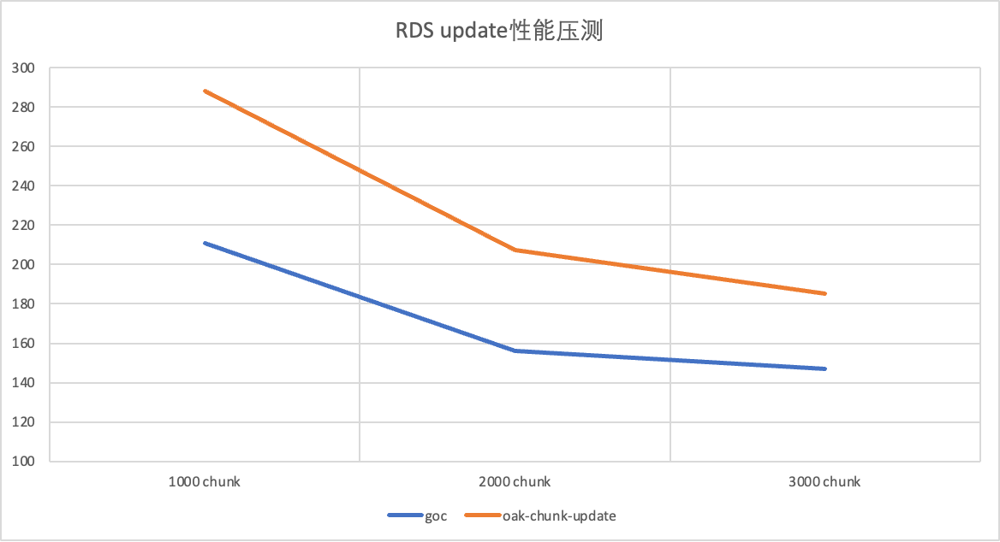

# go-oak-chunk

## 背景
使用`oak-chunk-update`(dml tools)在做dml变更的时候，因其设计原因，必定会扫描全表。导致了在对大表dml的时候，性能非常低。

如果用`pt-archiver`的话，不会产生全表扫描的情况，但只能做`delete`操作，无法完成`update`的数据变更。

此外，这两款工具都无法使用正常的SQL语句，或添加特殊字段、或只要求where子句。都会有一些心智上的负担。

故，由以上的原因开发了`go-oak-chunk`。使用tidb的`parser`模块解析dml语句，不用对`SQL`做特殊的改造，或者只写一部分的内容。
并且dml的chunk逻辑取自`pt-archiver`避免了全表扫描的可能性。

## 注意事项
### 1. 从库延迟检测
该工具会主动自主库获取从库，然后尝试连接从库、检测从库的延迟。
如果是云上集群，则会报个错，然后关闭从库延迟检测的功能继续进行chunk dml。（未对`tidb`做过测试，兼容性未知）


### 2. 关于`sleep`以及`notConsiderLag`参数的用法
执行chunk dml时，并没有直接使用`sleep`参数中断write协程，而是在该参数的基础上使用[令牌桶](https://en.wikipedia.org/wiki/Token_bucket)的形式
对write协程进行了限制。

`go-oak-chunk`工具在运行时，每毫秒会产生一个令牌，然后通过[**实际中断时间***1000]的形式，从令牌桶里取令牌的方式达到限流的方式。

令牌桶里的令牌因为每台机器的性能限制，无法真正做到精确时间，会有1-5毫秒的误差。不仅是为了解决这些误差，也让工具执行时稍微"慢"一点，于是加了50毫秒的修正。

如下压测缓解的数据证明，即使加了50毫秒的修正，该工具的性能依然非常出色。

#### 实际中断时间
有如下两种情况：

A. 当从库检测协程正常运行时

一、 NotConsiderLag不生效时
 1. slaveLag <= c.Sleep 此时，我们应该将bucket tokens和slaveLag进行绑定，说不定不用直接顶满c.Sleep就可以消除主从延迟
 2. slaveLag > c.Sleep && slaveLag-c.Sleep > 60*n 则实际等待时间要slaveLag+n

二、 NotConsiderLag生效时
1. 实际等待时间最大为c.Sleep。为了避免逻辑混乱，使用者在用了sleep参数后，会进行(c.sleep-1, c.sleep]的sleep时间


B. 当从库检测协程运行异常时

取(c.sleep-1, c.sleep]中的一个随机数


## 使用方法
```bash
$ ./goc run --help
Start chunk dml

Usage:
  goc run [flags]

Examples:
goc run -c --config <config file>


Flags:
      --chunk-size int                 Number of rows to act on in chunks.
                                       Zero(0) means all rows updated in one operation.
                                       One(1) means update/delete one row everytime.
                                       The lower the number, the shorter any locks are held, but the more operations required and the more total running time. (default 1000)
  -c, --config string                  config file path
      --cpuprofile file                write cpu profile to file
  -d, --database string                Database name (required unless table is fully qualified)
      --debug                          If debug_mode is true, print debug logs
      --exclude-slaves string          which slaves should be include, include_slaves and exclude_slaves are mutually exclusive.
                                       ex: ip or ip1,ip2,... without port
  -e, --execute string                 Query to execute, which must contain where clause
      --force-chunking-column string   Columns to chunk by. Format: for single column keys, or column1_name,column2_name,...
  -h, --help                           help for run
  -H, --host string                    MySQL host (default "localhost")
      --include-slaves string          which slaves should be include, include_slaves and exclude_slaves are mutually exclusive.
                                       ex: ip or ip1,ip2,... without port
      --max-lag int                    Pause chunk dml if the slave reach Threshold.
      --memprofile file                write memory profile to file
      --noConsiderLag                  If true: sleep value will not be overshoot
                                       false: if slave lag is very high, sleep will be overshoot
  -p, --password string                MySQL password
  -P, --port int                       TCP/IP port (default 3306)
      --print-progress                 Show number of affected rows during utility runtime
      --sleep int                      Number of seconds to sleep between chunks.
      --txn-size int                   Number of rows per transaction. (default 1000)
  -u, --user string                    MySQL user (default "root")
```

Sample:
```bash
# 打印详细日志 + debug信息
$ ./goc run --chunk-size 1000 --txn-size 2000 -d test -t mybenchx1 \
--execute "update mybenchx1 set k = 1 where created_at <= '2023-12-28 11:30:06'" \
--host 127.0.0.1 --port 3306 \
--user root --password 'xxx' \
--print-progress --debug

# 添加sleep和noConsiderLag参数
$ ./goc run --chunk-size 1000 --txn-size 2000 -d test -t mybenchx0 \
--execute "delete from mybenchx0 where created_at <= '2024-02-21 00:03:13'" \
--host 127.0.0.1 --port 3306 \
--user root --password 'xxx' \
--sleep 1 --noConsiderLag
```

## 压测结果
压测cmd
```bash
# goc
$ ./goc run --chunk-size 1000 --txn-size 2000 -d test -t mybenchx0 \
--execute "update mybenchx0 set k = 1 where created_at <= '2024-02-20 11:03:13'" \
--host 127.0.0.1 --port 3306 \
--user root --password 'xxx' \
--print-progress 

# oak-chunk-update.py
$ python oak-chunk-update.py -H 127.0.0.1 -P 3306 -u root -p 'xxx' \
-d test --chunk-size=1000 --slave-lag 999 -v \
-e "update mybenchx0 set k = 1 where created_at <= '2024-02-20 11:03:13' and OAK_CHUNK(mybenchx0)"

# pt-archiver
$ pt-archiver --source h=127.0.0.1,u=root,p='xxx',P=3306,D=test,t=mybenchx0 \
--no-check-charset --where "created_at <= '2024-02-20 11:03:13'" \
--limit 1000 --txn-size 2000 --purge --progress=1000 --bulk-delete --statistics 
```

压测表结构
测试使用工具: https://github.com/SisyphusSQ/mybenchx
```sql
CREATE TABLE `mybenchx0` (
  `id` bigint(20) unsigned NOT NULL AUTO_INCREMENT,
  `k` bigint(20) NOT NULL DEFAULT '0',
  `c` varchar(120) COLLATE utf8_bin NOT NULL DEFAULT '',
  `pad` varchar(60) COLLATE utf8_bin NOT NULL DEFAULT '',
  `created_at` datetime NOT NULL DEFAULT CURRENT_TIMESTAMP,
  `unix_stamp` bigint(20) NOT NULL DEFAULT '0',
  PRIMARY KEY (`id`),
  KEY `idx_created_at` (`created_at`),
  KEY `idx_unix_stamp` (`unix_stamp`)
) ENGINE=InnoDB AUTO_INCREMENT=1 DEFAULT CHARSET=utf8 COLLATE=utf8_bin
```

### Update性能测试
#### RDS压测 数据：3713388 rows（总5448241）
| #                | 参数                             | 耗时      | 备注                                                             |
|------------------|--------------------------------|---------|----------------------------------------------------------------|
| goc              | chunk-size=1 txn-size=1000     | 未完成     | 单条数据删除，非范围删除                                                   |
|                  |                                |         | 56m21s    660000                                               |
| goc              | chunk-size=1000 txn-size=1000  | 328s    | Total Processed Rows: 3713388, speed: 11250.09 rows/s          |
| goc              | chunk-size=1000 txn-size=2000  | 211s    | Total Processed Rows: 3713388, speed: 17429.37 rows/s          |
| goc              | chunk-size=2000 txn-size=4000  | 156s    | Total Processed Rows: 3713388, speed: 23349.05 rows/s          |
| goc              | chunk-size=3000 txn-size=6000  | 147s    | Total Processed Rows: 3713388, speed: 24748.83 rows/s          |
| oak-chunk-update | chunk-size=1000                | 288.2s  | 默认参数                                                           |
|                  |                                |         | 3713388 accumulating; seconds: 288.2 elapsed; 119.39 executed  |
| oak-chunk-update | chunk-size=2000                | 207.4s  | 3713388 accumulating; seconds: 207.4 elapsed; 107.46 executed  |
| oak-chunk-update | chunk-size=3000                | 185.3s  | 3713388 accumulating; seconds: 185.3 elapsed; 104.32 executed  |
| goc              | chunk-size=1000 txn-size=2000  | 1116s   | sleep是个(0,1]的浮动值                                               |
|                  | sleep=1(s)                     |         | Total Processed Rows: 3713388, speed: 3317.72 rows/s           |
| oak-chunk-update | chunk-size=1000 sleep=1000(ms) | 5724.3s | sleep是个1s定值                                                    |
|                  |                                |         | 3713388 accumulating; seconds: 5724.3 elapsed; 113.64 executed |



#### 私有云压测 数据：2044230 rows（总5405000）
| 工具               | 参数                                       | 耗时     | 备注                                                            |
|------------------|------------------------------------------|--------|---------------------------------------------------------------|
| goc              | chunk-size=1 txn-size=1000               | /      |                                                               |
| goc              | chunk-size=1000 txn-size=1000            | 114s   | Total Processed Rows: 2044230, speed: 17466.49 rows/s         |
| goc              | chunk-size=1000 txn-size=2000            | 63s    | Total Processed Rows: 2044230, speed: 30963.93 rows/s         |
| goc              | chunk-size=2000 txn-size=4000            | 36s    | Total Processed Rows: 2044230, speed: 52393.56 rows/s         |
| goc              | chunk-size=3000 txn-size=6000            | 27s    | Total Processed Rows: 2044230, speed: 68106.68 rows/s         |
| oak-chunk-update | chunk-size=1000                          | 696.0s | 默认参数                                                          |
|                  |                                          |        | 2044230 accumulating; seconds: 696.0 elapsed; 27.03 executed  |
| oak-chunk-update | chunk-size=2000                          | 353.8s | 2044230 accumulating; seconds: 353.8 elapsed; 18.23 executed  |
| oak-chunk-update | chunk-size=3000                          | 239.2s | 2044230 accumulating; seconds: 239.2 elapsed; 15.33 executed  |
| goc              | chunk-size=1000 txn-size=2000 sleep=1(s) | /      | sleep是个(0,1]的浮动值                                              ||
| oak-chunk-update | chunk-size=1000 sleep=1000(ms)           | 未完成    | sleep是个1s定值                                                   |
|                  |                                          |        | 1302922 accumulating; seconds: 3839.7 elapsed; 17.06 executed |


### Delete性能测试
#### RDS压测 数据：3713388 rows（总5448241）
| 工具               | 参数                                       | 耗时     | 备注                                                            |
|------------------|------------------------------------------|--------|---------------------------------------------------------------|
| goc              | chunk-size=1 txn-size=1000               | /      | 单条数据删除，非范围删除                                                  |
| goc              | chunk-size=1000 txn-size=1000            | 334s   | Total Processed Rows: 3713388, speed: 11049.12 rows/s         |
| goc              | chunk-size=1000 txn-size=2000            | 282s   | Total Processed Rows: 3713388, speed: 13026.09 rows/s         |
| goc              | chunk-size=2000 txn-size=4000            | 252s   | Total Processed Rows: 3713388, speed: 14558.70 rows/s         |
| goc              | chunk-size=3000 txn-size=6000            | 246s   | Total Processed Rows: 3713388, speed: 14908.98 rows/s         |
| oak-chunk-update | chunk-size=1000                          | 377.1s | 默认参数                                                          |
|                  |                                          |        | 3713388 accumulating; seconds: 377.1 elapsed; 153.91 executed |
| oak-chunk-update | chunk-size=2000                          | 312.5s | 3713388 accumulating; seconds: 312.5 elapsed; 152.46 executed |
| oak-chunk-update | chunk-size=3000                          | 284.5s | 3713388 accumulating; seconds: 284.5 elapsed; 159.96 executed |
| pt-archiver      | limit=1000 txn-size=1000                 | 457s   | Started at 2024-02-20T17:01:47, ended at 2024-02-20T17:09:24  |
|                  |                                          |        | Source: D=test,P=3306,h=127.0.0.1,p=...,t=mybenchx0,u=root    |
|                  |                                          |        | SELECT 3713387                                                |
|                  |                                          |        | INSERT 0                                                      |
|                  |                                          |        | DELETE 3713387                                                |
|                  |                                          |        | Action             Count       Time        Pct                |
|                  |                                          |        | bulk_deleting       3714   175.9435      38.43                |
|                  |                                          |        | select              3715    59.2423      12.94                |
|                  |                                          |        | commit              3714    24.2375       5.29                |
|                  |                                          |        | other                  0   198.3879      43.33                |
| pt-archiver      | limit=1000 txn-size=2000                 | 439s   | Started at 2024-02-20T17:15:00, ended at 2024-02-20T17:22:20  |
|                  |                                          |        | Source: D=test,P=3306,h=127.0.0.1,p=...,t=mybenchx0,u=root    |
|                  |                                          |        | SELECT 3713387                                                |
|                  |                                          |        | INSERT 0                                                      |
|                  |                                          |        | DELETE 3713387                                                |
|                  |                                          |        | Action             Count       Time        Pct                |
|                  |                                          |        | bulk_deleting       3714   146.6919      33.40                |
|                  |                                          |        | select              3715    65.5630      14.93                |
|                  |                                          |        | commit              1857    13.6087       3.10                |
|                  |                                          |        | other                  0   213.3417      48.57                |
| pt-archiver      | limit=2000 txn-size=4000                 | 422s   | Started at 2024-02-20T17:28:00, ended at 2024-02-20T17:35:02  |
|                  |                                          |        | Source: D=test,P=3306,h=127.0.0.1,p=...,t=mybenchx0,u=root    |
|                  |                                          |        | SELECT 3713387                                                |
|                  |                                          |        | INSERT 0                                                      |
|                  |                                          |        | DELETE 3713387                                                |
|                  |                                          |        | Action             Count       Time        Pct                |
|                  |                                          |        | bulk_deleting       1857   162.3538      38.43                |
|                  |                                          |        | select              1858    48.0480      11.37                |
|                  |                                          |        | commit               929     7.9062       1.87                |
|                  |                                          |        | other                  0   204.1619      48.33                |
| pt-archiver      | limit=3000 txn-size=6000                 | 410s   | Started at 2024-02-20T17:54:20, ended at 2024-02-20T18:01:11  |
|                  |                                          |        | Source: D=test,P=3306,h=127.0.0.1,p=...,t=mybenchx0,u=root    |
|                  |                                          |        | SELECT 3713387                                                |
|                  |                                          |        | INSERT 0                                                      |
|                  |                                          |        | DELETE 3713387                                                |
|                  |                                          |        | Action             Count       Time        Pct                |
|                  |                                          |        | bulk_deleting       1238   161.6140      39.33                |
|                  |                                          |        | select              1239    35.6418       8.67                |
|                  |                                          |        | commit               619     6.1584       1.50                |
|                  |                                          |        | other                  0   207.4860      50.50                |
| goc              | chunk-size=1000 txn-size=2000 sleep=1(s) | /      | sleep是个(0,1]的浮动值                                              ||
| oak-chunk-update | chunk-size=1000 sleep=1000(ms)           | /      | sleep是个1s定值                                                   |


#### 私有云压测 数据：2044230 rows（总5405000）
| 工具               | 参数                                       | 耗时     | 备注                                                           |
|------------------|------------------------------------------|--------|--------------------------------------------------------------|
| goc              | chunk-size=1 txn-size=1000               | /      | 单条数据删除，非范围删除                                                 |
| goc              | chunk-size=1000 txn-size=1000            | 123s   | Total Processed Rows: 2044230, speed: 16219.34 rows/s        |
| goc              | chunk-size=1000 txn-size=2000            | 72s    | Total Processed Rows: 2044230, speed: 27248.78 rows/s        |
| goc              | chunk-size=2000 txn-size=4000            | 42s    | Total Processed Rows: 2044230, speed: 45407.27 rows/s        |
| goc              | chunk-size=3000 txn-size=6000            | 31s    | Total Processed Rows: 2044230, speed: 61923.60 rows/s        |
| oak-chunk-update | chunk-size=1000                          | 702.4s | 默认参数                                                         |
|                  |                                          |        | 2043463 accumulating; seconds: 702.4 elapsed; 36.43 executed |
| oak-chunk-update | chunk-size=2000                          | 360.9s | 2044230 accumulating; seconds: 360.9 elapsed; 26.77 executed |
| oak-chunk-update | chunk-size=3000                          | 248.9s | 2044230 accumulating; seconds: 248.9 elapsed; 23.61 executed |
| pt-archiver      | limit=1000 txn-size=1000                 | 93s    | Started at 2024-02-20T18:06:04, ended at 2024-02-20T18:07:37 |
|                  |                                          |        | Source: D=test,P=3306,h=127.0.0.1,p=...,t=mybenchx0,u=root   |
|                  |                                          |        | SELECT 2044230                                               |
|                  |                                          |        | INSERT 0                                                     |
|                  |                                          |        | DELETE 2044230                                               |
|                  |                                          |        | Action             Count       Time        Pct               |
|                  |                                          |        | bulk_deleting       2045    19.9001      21.25               |
|                  |                                          |        | select              2046     7.4088       7.91               |
|                  |                                          |        | commit              2045     4.4744       4.78               |
|                  |                                          |        | other                  0    61.8726      66.06               |
| pt-archiver      | limit=1000 txn-size=2000                 | 88s    | Started at 2024-02-20T18:09:32, ended at 2024-02-20T18:11:00 |
|                  |                                          |        | Source: D=test,P=3306,h=127.0.0.1,p=...,t=mybenchx0,u=root   |
|                  |                                          |        | SELECT 2044230                                               |
|                  |                                          |        | INSERT 0                                                     |
|                  |                                          |        | DELETE 2044230                                               |
|                  |                                          |        | Action             Count       Time        Pct               |
|                  |                                          |        | bulk_deleting       2045    18.1700      20.60               |
|                  |                                          |        | select              2046     6.8679       7.79               |
|                  |                                          |        | commit              1023     2.9333       3.33               |
|                  |                                          |        | other                  0    60.2291      68.29               |
| pt-archiver      | limit=2000 txn-size=4000                 | 82s    | Started at 2024-02-20T18:13:26, ended at 2024-02-20T18:14:48 |
|                  |                                          |        | Source: D=test,P=3306,h=127.0.0.1,p=...,t=mybenchx0,u=root   |
|                  |                                          |        | SELECT 2044230                                               |
|                  |                                          |        | INSERT 0                                                     |
|                  |                                          |        | DELETE 2044230                                               |
|                  |                                          |        | Action             Count       Time        Pct               |
|                  |                                          |        | bulk_deleting       1023    16.0654      19.45               |
|                  |                                          |        | select              1024     5.5288       6.69               |
|                  |                                          |        | commit               512     2.1804       2.64               |
|                  |                                          |        | other                  0    58.8304      71.22               |
| pt-archiver      | limit=3000 txn-size=6000                 | 79s    | Started at 2024-02-20T18:16:42, ended at 2024-02-20T18:18:01 |
|                  |                                          |        | Source: D=test,P=3306,h=127.0.0.1,p=...,t=mybenchx0,u=root   |
|                  |                                          |        | SELECT 2044230                                               |
|                  |                                          |        | INSERT 0                                                     |
|                  |                                          |        | DELETE 2044230                                               |
|                  |                                          |        | Action             Count       Time        Pct               |
|                  |                                          |        | bulk_deleting        682    15.2692      19.14               |
|                  |                                          |        | select               683     4.8427       6.07               |
|                  |                                          |        | commit               341     1.8205       2.28               |
|                  |                                          |        | other                  0    57.8531      72.51               |
| goc              | chunk-size=1000 txn-size=2000 sleep=1(s) | /      | sleep是个(0,1]的浮动值                                             |
| oak-chunk-update | chunk-size=1000 sleep=1000(ms)           | /      | sleep是个1s定值                                                  |


## 结论
| #                                                        | Update                                                            | Delete                                    |
|----------------------------------------------------------|-------------------------------------------------------------------|-------------------------------------------|
| goc                                                      | 私有云update的效率要比公有云高                                                | delete的效率没有update高                        |
|                                                          | 随着chunk-size和txn-size的提升，效率也有明显的提升，但是在chunk-size=3000的时候，明显感受到了瓶颈 |                                           |
|                                                          | sleep的时间是个(0,x]的浮动值，效率一定比x的值要高。但是是否在公有云中产生从库延迟是未知的                |                                           |
|                                                          | 在私有云中只要产生了从库延迟，x值是sleep的下限，所以不会有这种情况发生                            |                                           |
| oak                                                      | 私有云和公有云update的效率差不多                                               | delete效率明显没有goc好                          |
|                                                          | 在需要update的数据与全表数据占比不高的时候，oak工具就会显得特别慢（因为需要扫描全表）                   | 全表扫描                                      |
|                                                          | 如果未开启从库延迟检测，且有sleep的x值时，会固定sleep x的值，导致了工具效率非常低                   |                                           |
| pt-archiver                                              | /                                                                 | 避免全表扫描                                    |
|                                                          |                                                                   | 私有云使用pt的delete性能非常好，公有云使用pt的delete性能不是特别好 |
 
总结：                                          
* goc的性能可以说是优于oak和pt-archiver，且用pt的实现方式避免了全表扫描的可能性     
* 在压力调高的情况下，goc的性能表现要好于pt-archiver；压力低的情况下，pt-archiver会好一点
* goc的性能在某些情况下相较于oak节省6倍时间 
* 参数上没有其他两款产品多


