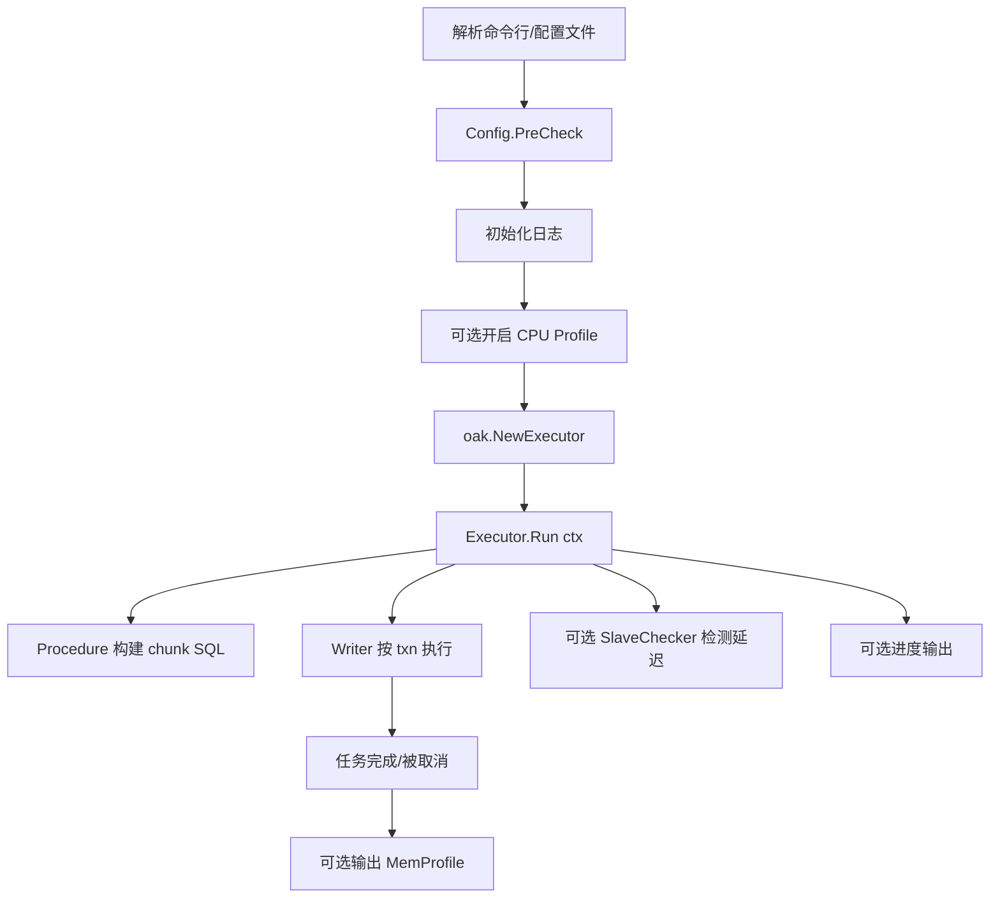

# go-oak-chunk CLI 使用手册（v3）

[English](cli-usage-en.md) | [简体中文](cli-usage.md)

## 1. 文档目标

这份文档用于说明如何以 **CLI（命令行）方式** 使用 `go-oak-chunk` 执行大表 `UPDATE/DELETE` 的分块 DML。

覆盖内容：

- 安装与启动
- `run` 子命令参数详解
- 配置文件写法与参数映射
- 执行流程与限流/延迟控制机制
- 性能调优建议
- 常见报错与排障

---

## 2. 你会得到什么能力

`go-oak-chunk` 的 CLI 核心能力：

- 只支持 `UPDATE` / `DELETE`（单条 SQL），按 chunk 分批执行
- 利用主键/唯一键推进游标，避免全表扫描式批处理
- 多数据源专属加速（DELETE）：
  - **OceanBase**：覆盖索引两阶段快路径（`--select-order-by`），可进一步**分区并行**（`--partition-concurrency`）
  - **TiDB**：按隐藏行句柄 `_tidb_rowid` 分块（`--tidb-rowid`），支持**无主键/唯一键**的 NONCLUSTERED 表
- 统一限流与守护边界：令牌桶（`--sleep`）+ 全局行速率（`--rows-per-sec`）+ 从库延迟感知（`--max-lag`），`--max-rows` / `--max-duration-ms` 跑够即停
- 长任务 NOW() 时间冻结、失败错误分类重试（含 OB/TiDB 专属码）
- 支持运行中进度输出
- 支持 `SIGINT/SIGTERM` 优雅停止、`--dry-run` 预览、EXPLAIN 大表预检
- 支持 CPU / Memory profile 输出

---

## 3. 快速开始

### 3.1 构建二进制

```bash
make build
```

默认会生成 `goc`（来自 `Makefile` 中 `BINARY_NAME`）。

### 3.2 查看版本

```bash
./goc version
```

### 3.3 查看帮助

```bash
./goc --help
./goc run --help
```

如果你不想先构建，也可以直接：

```bash
go run ./cmd/go-oak-chunk run --help
```

---

## 4. 命令结构

- 根命令：`go-oak-chunk`（或构建后通常叫 `goc`）
- 子命令：
  - `run`：执行 chunk DML
  - `version`：打印版本信息（应用版本、Go 版本、构建时间、Git 信息）

---

## 5. `run` 参数详解（命令行模式）

> 说明：如果你传了 `--config`，大部分业务参数会从配置文件读取，本节参数仍然可作为参考。

| 参数 | 类型/默认值 | 必填 | 说明 | 关键注意点 |
|---|---|---|---|---|
| `-c, --config` | string / 空 | 否 | TOML 配置文件路径 | 开启配置文件模式 |
| `--cpuprofile` | string / 空 | 否 | 输出 CPU profile 文件 | 运行开始时启用 |
| `--memprofile` | string / 空 | 否 | 输出内存 profile 文件 | 任务结束后写出 |
| `--chunk-size` | int64 / `1000` | 否 | 每个 chunk 处理行数 | `0` 表示一次性；`1` 表示逐行 |
| `-e, --execute` | string / 空 | 是 | 要执行的 SQL | 必须是单条 `UPDATE/DELETE`，应包含 `WHERE` |
| `--force-chunking-column` | string / 空 | 否 | 强制指定 chunk 键列 | 必须与某个主键/唯一键列集合一致；OB 下会额外基于 `SHOW INDEX` 校验 |
| `-H, --host` | string / `localhost` | 否 | MySQL 主机 | |
| `-P, --port` | int / `3306` | 否 | MySQL 端口 | |
| `-u, --user` | string / `root` | 否 | MySQL 用户 | |
| `-p, --password` | string / 空 | 否 | MySQL 密码 | |
| `-d, --database` | string / 空 | SQL 未使用 `schema.table` 时必填 | 目标库名 | 与 SQL schema 同时提供时必须逐字一致，包括大小写 |
| `--txn-size` | int64 / `1000` | 否 | 每个事务最多处理行数 | 控制单事务体量 |
| `--sleep` | int64 / `0` | 否 | chunk 间 sleep（毫秒） | 单位是 **毫秒** |
| `--noConsiderLag` | bool / `false` | 否 | 是否忽略 lag 放大逻辑 | `true` 时 sleep 不会被大幅拉高 |
| `--max-lag` | int64 / `0` | 否 | 延迟阈值（秒） | `>0` 时达到阈值会主动降速 |
| `--include-slaves` | string / 空 | 否 | 仅监控这些从库 IP（逗号分隔） | 与 `--exclude-slaves` 互斥 |
| `--exclude-slaves` | string / 空 | 否 | 排除这些从库 IP（逗号分隔） | 与 `--include-slaves` 互斥 |
| `--no-slaves` | bool / `false` | 否 | 跳过从库延迟检测 | TiDB/OceanBase 场景常用 |
| `--print-progress` | bool / `false` | 否 | 控制台打印进度 | 每 3 秒刷新 |
| `--no-progress-bar` | bool / `false` | 否 | 纯日志模式，关闭终端进度显示 | 优先于 `--print-progress` 和 TOML 的 `print_progress` |
| `--debug` | bool / `false` | 否 | 打开 debug 日志 | |
| `--rows-per-sec` | int64 / `0` | 否 | 全局每秒行数上限 | `0` 表示不限速；与 `--sleep`/`--max-lag` 叠加生效 |
| `--select-order-by` | string / 空 | 否 | 两阶段候选 SELECT 的排序列（逗号分隔） | 开启覆盖索引快路径（仅 DELETE）；`--partition-concurrency` 的前置条件 |
| `--select-index` | string / 空 | 否 | 候选 SELECT 的 `FORCE INDEX` 名 | 需配合 `--select-order-by`；不填则交由优化器选择 |
| `--select-cursor` | bool / `false` | 否 | 用游标推进候选 SELECT，避免每轮从头重扫 | 需配合 `--select-order-by`；大表强烈建议开启 |
| `--max-rows` | int64 / `0` | 否 | 处理满指定行数后停止 | `0` 表示不限；对 range/covering/partition 三种策略均生效 |
| `--max-duration-ms` | int64 / `0` | 否 | 运行满指定毫秒后停止 | `0` 表示不限；对三种策略均生效 |
| `--partition-concurrency` | int / `0` | 否 | OceanBase 专属：分区并行 DELETE 的 worker 数 | `0/1` 关闭；需配合 `--select-order-by` 且表为分区表 |
| `--tidb-rowid` | bool / `false` | 否 | TiDB 专属：按隐藏 `_tidb_rowid` 分块 DELETE | 仅 DELETE；NONCLUSTERED 表、无需 PK/UK；与覆盖快路径/分区并发/`--force-chunking-column` 互斥 |
| `--dry-run` | bool / `false` | 否 | 只打印样例 SQL，不实际执行 | 用于预览快路径 SELECT/DELETE 形态 |
| `--preflight-threshold` | int64 / `0` | 否 | EXPLAIN 预估大表确认阈值 | `0` 表示用默认值 `100000` |
| `--yes` | bool / `false` | 否 | 跳过大表确认交互 | SDK/非交互场景建议开启 |

脚本收集输出时，使用 `--no-progress-bar` 关闭终端进度显示，保留正常运行及失败日志，避免进度显示产生的清屏、光标移动和终端初始化。即使同时传入 `--print-progress`，或配置文件设置了 `print_progress = true`，仍以 `--no-progress-bar` 为准，与参数顺序无关。`--no-progress-bar=false` 不覆盖原有进度设置。该选项不改变退出码或大表确认行为。

```bash
./goc run -c /path/to/example.toml --no-progress-bar
```

---

## 6. 配置文件模式（推荐生产）

### 6.1 启动方式

```bash
./goc run -c /path/to/example.toml
```

### 6.2 参数来源优先级

当 `--config` 生效时：

- 业务参数来自 TOML（如 chunk、SQL、连接信息等）
- `--cpuprofile` / `--memprofile` 仍由命令行控制
- `--no-progress-bar` 仍生效，可强制关闭 TOML 中开启的进度显示

可理解为“配置文件模式优先”。

### 6.3 TOML 字段映射

| TOML 字段 | 对应 CLI 参数 | 说明 |
|---|---|---|
| `chunk_size` | `--chunk-size` | chunk 大小 |
| `execute_query` | `--execute` | 执行 SQL |
| `forced_chunking_column` | `--force-chunking-column` | 强制 chunk 键（注意是 **forced**） |
| `host` | `--host` | 主库地址 |
| `port` | `--port` | 主库端口 |
| `database` | `--database` | 库名 |
| `user` | `--user` | 用户 |
| `password` | `--password` | 密码 |
| `print_progress` | `--print-progress` | 打印进度 |
| `sleep` | `--sleep` | 毫秒级 sleep |
| `no_consider_lag` | `--noConsiderLag` | lag 处理策略 |
| `max_lag` | `--max-lag` | 延迟阈值 |
| `include_slaves` | `--include-slaves` | 仅包含这些从库 |
| `exclude_slaves` | `--exclude-slaves` | 排除这些从库 |
| `no_slaves` | `--no-slaves` | 跳过从库检测 |
| `txn_size` | `--txn-size` | 事务大小 |
| `debug_mode` | `--debug` | debug 模式 |
| `rows_per_sec` | `--rows-per-sec` | 全局每秒行数上限（`0`=不限） |
| `select_order_by` | `--select-order-by` | 覆盖索引快路径排序列（默认空=关闭） |
| `select_index` | `--select-index` | 候选 SELECT 的 FORCE INDEX 名（默认空） |
| `select_cursor` | `--select-cursor` | 游标推进（默认 `false`；需配合 `select_order_by`） |
| `max_rows` | `--max-rows` | 处理满行数后停止（`0`=不限） |
| `max_duration_ms` | `--max-duration-ms` | 运行满毫秒后停止（`0`=不限） |
| `partition_concurrency` | `--partition-concurrency` | OceanBase 分区并行 worker 数（`0/1`=关闭） |
| `tidb_rowid` | `--tidb-rowid` | TiDB 按 `_tidb_rowid` 分块 DELETE（默认 `false`） |
| `dry_run` | `--dry-run` | 只打印样例 SQL（默认 `false`） |
| `preflight_threshold` | `--preflight-threshold` | 大表确认阈值（`0`=默认 `100000`） |
| `auto_confirm` | `--yes` | 跳过大表确认（默认 `false`） |
| `correct` | 无直接 flag（内部修正值） | 建议维持 `50` |
| `no_log_bin` | 暂无 CLI 暴露 | 当前版本保留字段 |

### 6.4 推荐模板

```toml
debug_mode = true
chunk_size = 1000
execute_query = "DELETE FROM my_table WHERE created_at < '2025-01-01 00:00:00'"
forced_chunking_column = ""

host = "127.0.0.1"
port = 3306
database = "test_db"
user = "root"
password = "xxx"

print_progress = true
sleep = 0
no_consider_lag = false
max_lag = 0
include_slaves = ""
exclude_slaves = ""
no_slaves = false

txn_size = 2000
correct = 50
```

---

## 7. SQL 约束与执行前校验

CLI 启动后会做关键校验：

1. `chunk_size` 不能为负数
2. `execute_query` 不能为空
3. `include_slaves` 与 `exclude_slaves` 互斥
4. SQL 未使用 `schema.table` 时，`database` 必须非空；两者同时提供时必须逐字一致，包括大小写
5. SQL 必须是单条语句
6. SQL 类型必须是 `UPDATE` 或 `DELETE`
7. 目标表必须存在
8. 目标表必须存在可用主键/唯一键
9. 若设置 `forced_chunking_column`，必须精确匹配某个唯一键列集合；逗号两侧空格会自动忽略

---

## 8. 执行流程（CLI 到核心执行）



---

## 9. 限流与从库延迟控制机制

### 9.0 工作原理（两套独立机制）

限流由**两套相互独立**的机制组成，都在「每个 chunk 提交后」生效，最终节奏取决于更严格的那个：

**机制 A：sleep / 从库延迟节流（令牌桶）**——管「时间节奏 + 从库保护」，受 `sleep`、`max_lag`、`no_consider_lag`、`correct` 控制。

- **令牌桶**：1ms 粒度（1 token = 1 毫秒，每秒产 1000 个），token 数即「要等待的毫秒数」。
- **控制器 `getStopTime` 协程**循环计算应等待的 token 数，通过 `bucketNum` 通道喂给消费者：
  1. 探测从库延迟 `lag`（`--no-slaves` 或无主从拓扑时跳过）；
  2. 若 `lag >= max_lag`：推入哨兵值 `LagThreshold(-1)`，自身 sleep 800ms，通知消费者「暂停 ~1s 等从库追平」；
  3. 否则按 `sleep`/`lag`/`no_consider_lag` 算出 token 数，叠加修正值 `correct`（默认 50，节流时增大、平时衰减，用于吸收机器 1~5ms 计时误差）后推出；
  4. 自身 sleep「上一 chunk 耗时 × 5/4」（自适应轮询间隔）。
- **消费者**（Writer / 覆盖 / 分区策略）每个 chunk 前非阻塞取 `bucketNum` 最新值：`-1` → 暂停 ~1s；`>0` → `Bucket.Wait(n)` 等 n 毫秒；`0`（`sleep=0` 且无 lag）→ 不等待。

**机制 B：行速率节流（rows-per-sec）**——管「行吞吐上限」，独立于令牌桶（`task/rows_limiter.go`）。

- 每个 chunk 删/改完后按本批实际行数等待 `affected / rows_per_sec` 秒；`0`=不限速；可被 ctx 取消（SIGINT 立即停）。

**分区并发**下，令牌桶与 rows-per-sec limiter 均为**全局共享**，限制的是**全表合计**速率；从库延迟暂停会广播给所有 worker 一起暂停。

> 取舍速查：要「批次节奏 / 保护从库」用 `--sleep` + `--max-lag`；要「封顶每秒行数」用 `--rows-per-sec`；全关即跑满速。

### 9.1 sleep 的真实行为

- `sleep=0`：不主动 sleep
- `0 < sleep <= 1000`：通常是 `[0, sleep)` 的随机等待
- `sleep > 1000`：通常是 `[sleep-1000, sleep)` 的随机等待

### 9.2 noConsiderLag

- `true`：sleep 不会被高 lag 进一步放大（更“硬”）
- `false`：会根据 lag 进行放大（更保守）

### 9.3 max-lag

当 `max_lag > 0` 且检测到 `lag >= max_lag` 时，执行会主动降速等待，给从库追平时间。

### 9.4 no-slaves

- `--no-slaves=true`：完全跳过从库延迟检测，只按 sleep/令牌桶节奏走
- 适合无标准主从拓扑场景（如 TiDB/OceanBase）

### 9.5 rows-per-sec（全局行速率上限）

`--rows-per-sec` 在令牌桶（`sleep`）和从库延迟（`max-lag`）之外，再叠加一个**按行**的全局速率上限：

- 含义是“每秒最多处理多少行”，每次执行 DML 前会按本批行数申请配额，配额不足则等待
- 与 `--sleep`/`--max-lag` **叠加**生效：三者都会让 Writer 等待，最终节奏取决于最严格的那个
- `--rows-per-sec=0`：不限速（默认）
- 该限速器是 **全局共享** 的：在分区并行模式下，所有 worker 共用同一个限速器，限制的是**全表合计**的行速率，而不是每个 worker 各自的速率

> 跑满速：`--sleep 0 --rows-per-sec 0`（且无 `--max-lag` 触发）时不会有任何隐式等待，覆盖索引/分区 DELETE 会以数据库能承受的速率执行。
> （v3.2.0 之前的版本存在一个 bug：这两条路径每个 chunk 后会按删除行数误等待 ~1ms/行，导致即使关闭限速也被压到 ~1000 行/秒，已修复。）

---

## 9bis. 守护边界：max-rows / max-duration-ms

`--max-rows` 与 `--max-duration-ms` 是“跑够就停”的护栏，二者任一触达即停止：

- `--max-rows=N`：累计处理满 `N` 行后停止；`0` 表示不限
- `--max-duration-ms=T`：运行满 `T` 毫秒后停止；`0` 表示不限

> 说明：早期版本只允许在覆盖索引快路径（`--select-order-by`）上设置这两个参数，该限制已移除。
> 现在 range（普通分块）、covering（覆盖索引快路径）、partition（分区并行）三种策略均会强制执行这两个边界。

停止是**粗粒度**的，各路径的停止时机不同：

- range 路径：在一个事务 / chunk 边界上检查并停止（用 `writer.GetRowAffects()` + 起始时间判断）
- covering 路径：在一个 chunk 边界上停止
- partition 路径：DELETE 前预留配额并把本批裁剪到剩余额度，`--max-rows` 在多 worker 间精确生效（合计不超过 `max-rows`，不会超删；详见 §12bis）

---

## 10. 停止语义与退出行为

CLI 对 `SIGINT/SIGTERM` 是优雅停止：

- 收到信号后取消运行上下文
- 内部统一映射为 `task.ErrExecutionStopped`
- `run` 子命令将其视为“正常停止”，返回成功（非错误退出）

这意味着你可以安全地用 `Ctrl+C` 中断任务，而不是硬杀进程。

---

## 11. Profile 使用

### 11.1 CPU Profile

```bash
./goc run ... --cpuprofile cpu.pprof
go tool pprof -http=:8080 cpu.pprof
```

### 11.2 Memory Profile

```bash
./goc run ... --memprofile mem.pprof
go tool pprof -http=:8081 mem.pprof
```

---

## 12. 常用命令示例

### 12.1 基础 UPDATE

```bash
./goc run \
  -d test \
  -e "UPDATE mybenchx1 SET k = 1 WHERE created_at <= '2024-12-28 11:30:06'" \
  --chunk-size 1000 \
  --txn-size 2000 \
  -H 127.0.0.1 -P 3306 -u root -p 'xxx' \
  --print-progress
```

### 12.2 带延迟保护的 DELETE

```bash
./goc run \
  -d test \
  -e "DELETE FROM mybenchx0 WHERE created_at <= '2024-12-21 00:03:13'" \
  --chunk-size 1000 \
  --txn-size 2000 \
  --sleep 300 \
  --max-lag 3 \
  --include-slaves "10.0.0.12,10.0.0.13" \
  -H 127.0.0.1 -P 3306 -u root -p 'xxx' \
  --print-progress --debug
```

### 12.3 使用配置文件

```bash
./goc run -c ./conf/example.toml --cpuprofile cpu.pprof --memprofile mem.pprof
```

### 12.4 TiDB/OceanBase 风格环境（跳过从库检测）

```bash
./goc run \
  -d test \
  -e "DELETE FROM t WHERE id > 1000000" \
  --no-slaves \
  --chunk-size 2000 \
  --txn-size 4000 \
  -H 127.0.0.1 -P 4000 -u root -p 'xxx'
```

> OceanBase 下会先通过兼容 DDL 获取列定义，再额外执行 `SHOW INDEX` 识别主键/唯一键。
> 因此即使兼容 DDL 中缺失全局唯一键，`--force-chunking-column order_code` 这类指定也仍可命中真实唯一索引。

---

## 12bis. OceanBase 分区并行 DELETE（`--partition-concurrency`）

这是 OceanBase 专属的加速能力：把覆盖索引两阶段 DELETE 快路径**按分区并行**执行。

### 12bis.1 生效条件

- 数据源必须是 **OceanBase**
- 必须走覆盖索引快路径，即提供 `--select-order-by`（仅 DELETE）
- 目标表必须是**分区表**（运行时通过 `information_schema.PARTITIONS` 探测）
- `--partition-concurrency >= 2` 才会启用；`0/1` 退回单 worker 的 covering / range 路径

### 12bis.2 并发行为

- worker 数会被钳制到 `min(配置值, 实际分区数, 内部硬上限 64)`
- 每个 worker 抢占一个分区名、独占自己的游标，DELETE 作用域限定在 ``\`db\`.\`table\` PARTITION (\`name\`)``
- 连接池上限会随并发自动放大（约为 `并发数 + 2`），避免 worker 互相抢连接
- 限速器（令牌桶 + `--rows-per-sec`）是**全局共享**的：限制的是全表合计速率，并发不会绕过限速
- 从库延迟暂停（`--max-lag` 命中）是**全局**的：会让所有 worker 一起暂停等待从库追平
- `--max-rows` 在多 worker 间精确生效：每个 worker DELETE 前在共享计数上预留 `min(本批行数, 剩余额度)` 并把本批裁剪到该额度，预留在锁内串行化，因此各 worker 已删前缀之和**永不超过** `max-rows`（零超删；若真实 DELETE 影响行数小于预留则可能略微少删，属安全方向）。`--max-rows=0` 仍为完全不限
- 任一 worker 报错会取消整个并发组，第一个错误向上返回

### 12bis.3 示例

```bash
./goc run \
  -d test \
  -e "DELETE FROM orders WHERE created_at < '2025-01-01 00:00:00'" \
  --select-order-by "id" \
  --partition-concurrency 4 \
  --rows-per-sec 50000 \
  --max-rows 2000000 \
  --no-slaves \
  --chunk-size 2000 \
  -H 127.0.0.1 -P 2881 -u root@sys -p 'xxx'
```

> 上例在 OceanBase 分区表 `orders` 上以 4 个 worker 并行删除，全表合计不超过 5 万行/秒，累计删满 200 万行即停止。

---

## 12ter. TiDB `_tidb_rowid` 清理（`--tidb-rowid`）

TiDB 专属能力：用隐藏行句柄 `_tidb_rowid` 做分块键，让**无主键/唯一键**的 TiDB 表也能分批 DELETE（默认 `RangeStrategy` 需要可用的 PK/UK，否则直接报错无法运行）。

### 12ter.1 生效条件

- 显式加 `--tidb-rowid`（不改 TiDB 默认行为；默认 TiDB 仍走 `RangeStrategy`）
- 仅 **DELETE**（`PreCheck` 拒绝 UPDATE）
- 目标表必须是 TiDB **NONCLUSTERED（非聚簇）** 表 —— 只有这类表才有隐藏的 `_tidb_rowid`；运行时通过 `information_schema.tables.TIDB_PK_TYPE` 校验，**CLUSTERED 表会清晰报错**（老版本无该列时回退为 `SELECT _tidb_rowid ... LIMIT 1` 探测）
- 与 `--select-order-by`/`--select-cursor`/`--select-index`/`--partition-concurrency>1`/`--force-chunking-column` **互斥**
- 需要 `--chunk-size > 0`

### 12ter.2 算法

每个 chunk 两步，单 worker，游标只在 DELETE 提交后前移：

1. `SELECT _tidb_rowid FROM \`db\`.\`t\` WHERE <冻结WHERE> [AND _tidb_rowid > ?] ORDER BY _tidb_rowid LIMIT <chunk-size>`
2. `DELETE FROM \`db\`.\`t\` WHERE <冻结WHERE> AND _tidb_rowid IN (...)`

采用 **seek 游标**（`_tidb_rowid > cursor`）而非 `MIN/MAX` 算术步进：`SHARD_ROW_ID_BITS`/`AUTO_RANDOM` 会把 rowid 散布到 int64 高位，算术步进会产生海量空范围；seek 方式对间隙不敏感。DELETE 始终复用**冻结后的 WHERE**，IN 列表精确锁定生产者看到的句柄，绝不会触及谓词外或 SELECT/DELETE 间新插入的行。`--max-rows`/`--max-duration-ms` 护栏、`--rows-per-sec`/sleep/lag 限流、失败重试均复用既有机制（含 TiDB 写冲突码 9007/8022/8028 重试）。

### 12ter.3 示例

```bash
./goc run \
  --tidb-rowid \
  -d test \
  -e "DELETE FROM rule_set_exe_history WHERE create_time <= date_sub(now(), interval 15 day)" \
  --chunk-size 1000 \
  --rows-per-sec 50000 \
  --no-slaves \
  --print-progress \
  -H 127.0.0.1 -P 4000 -u root -p 'xxx'
```

```bash
# 先 dry-run 预览样例 SELECT/DELETE
./goc run --tidb-rowid --dry-run -d test -e "DELETE FROM t WHERE create_time <= now()" --chunk-size 1000 ...
```

---

## 13. 性能调优建议

### 13.1 参数联动原则

- 优先调 `chunk-size` 与 `txn-size`
- 再用 `sleep`、`max-lag` 控制对从库冲击
- 一般建议 `txn-size >= chunk-size`

### 13.2 建议起步值

| 场景 | chunk-size | txn-size | sleep | max-lag |
|---|---:|---:|---:|---:|
| 保守（线上高峰） | 500~1000 | 1000~2000 | 200~800 | 2~5 |
| 平衡（常规） | 1000~2000 | 2000~4000 | 0~300 | 0~3 |
| 激进（低峰+可回滚） | 2000~5000 | 4000~10000 | 0~100 | 0~1 |

---

## 14. 常见报错与排障

| 现象/错误 | 可能原因 | 处理建议 |
|---|---|---|
| `query to execute must be provided` | 未传 `--execute` 或配置缺失 | 补齐 SQL |
| `chunk size must be nonnegative` | `chunk-size < 0` | 改为 `>=0` |
| `--include-slaves and --exclude-slaves are mutually exclusive` | 两个参数同时设置 | 保留一个 |
| `no database specified` | 未设置 `--database`/`database`，SQL 也未使用 `schema.table` | 显式传库名或使用全限定表名 |
| `database mismatch` | `--database`/`database` 与 SQL schema 未逐字一致（包括大小写） | 统一为完全相同的库名；工具会在连接前停止 |
| `table xxx does not exist` | 库名或表名错误 | 检查 `database` 与 SQL |
| `please confirm sql type is update or delete` | SQL 不是 Update/Delete | 改为支持类型 |
| `can't find any index which is primary or unique key` | 目标表无主键/唯一键 | 增加唯一键或改表 |
| `forced_chunking_column doesn't conform ...` | 指定 chunk 列不匹配唯一键 | 改为真实唯一键列集合 |
| `show index ... failed` | OceanBase 索引元数据查询失败 | 检查权限、连接状态与表名；显式设置 `forced_chunking_column` 时会直接失败 |
| 运行中提示 `task stopped by signal` | 收到 SIGINT/SIGTERM | 正常停止语义 |
| 从库 lag 查询错误后继续运行 | 某些从库不可用或非标准拓扑 | 可用 `--no-slaves` 或过滤从库 |

---

## 15. 生产使用建议（强烈建议）

- 在影子库或小范围先做参数压测
- SQL 必须带明确 `WHERE`，避免误操作
- 使用最小权限账号，避免高危权限扩散
- 先备份或确保可回滚路径
- 高峰期使用保守参数，低峰期逐步放大
- 保留 profile 和执行日志，便于复盘

---

## 16. 与当前实现相关的注意事项（避免踩坑）

1. SQL 使用 `schema.table` 时可省略 `database`；两者同时提供时必须逐字一致，包括大小写
2. `sleep` 单位是 **毫秒**，不是秒
3. 配置文件键是 `forced_chunking_column`，不是 `force_chunking_column`
4. CLI 无配置文件时会自动把 `correct` 设为 `50`；配置文件模式建议显式给 `correct = 50`
5. `run` 正常被信号停止时按成功处理，不属于错误退出

以上 5 点建议在团队内作为统一使用约定。
